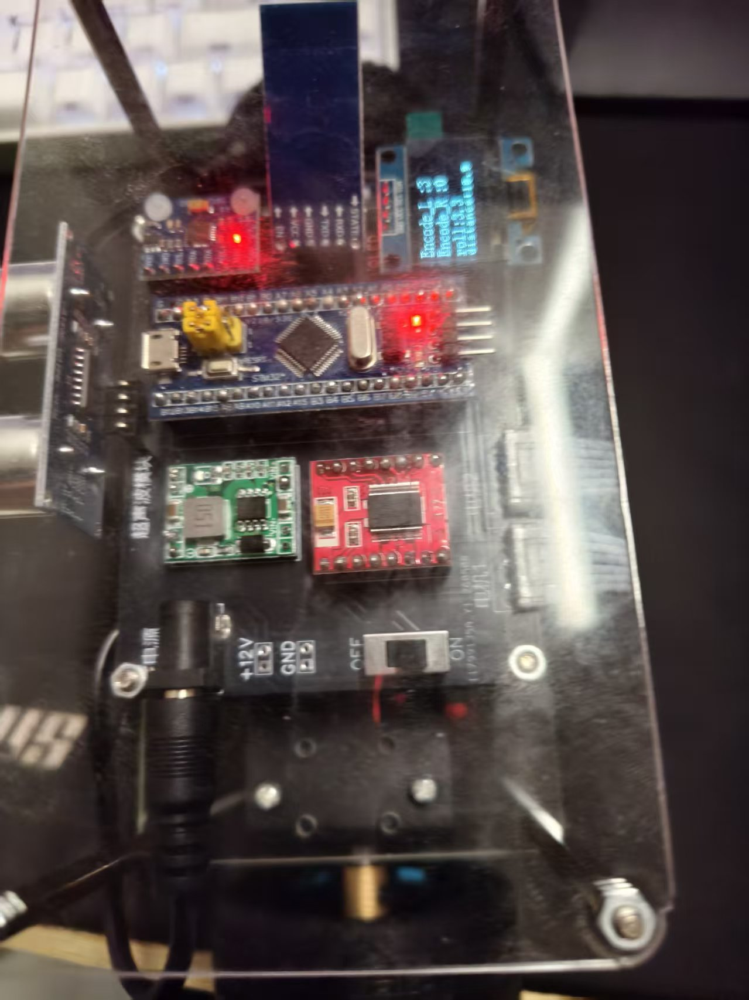
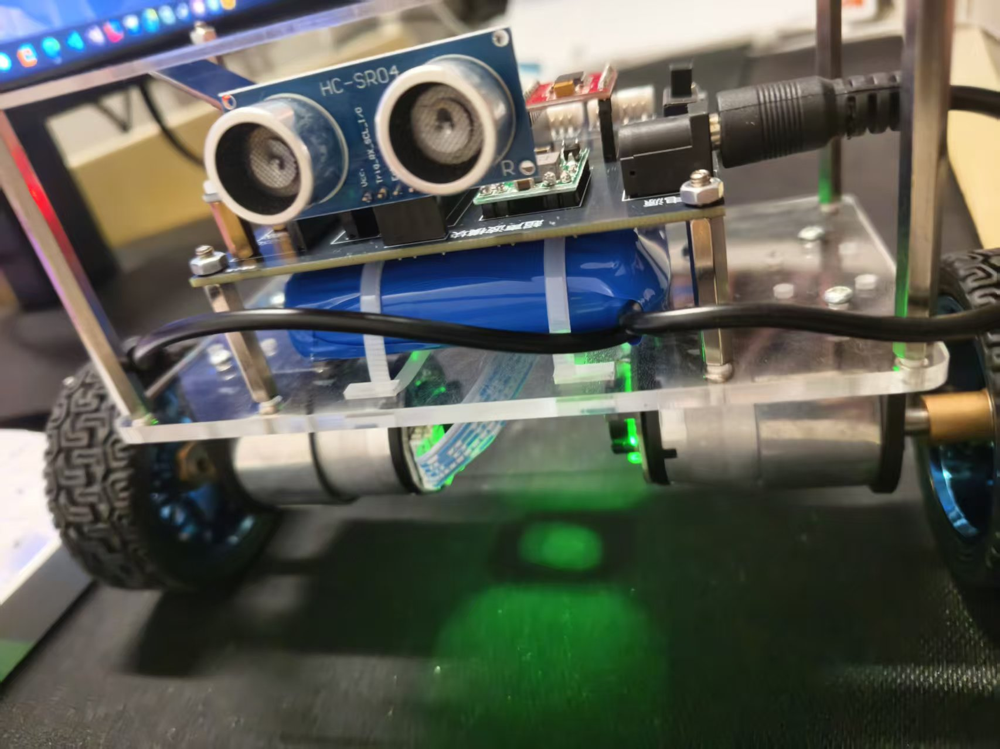

# 平衡小车控制程序

## 项目简介

本项目是一个基于STM32F103系列微控制器的**两轮自平衡小车**控制系统。小车通过MPU6050传感器获取姿态角（俯仰角、横滚角），结合编码器反馈的轮速信息，采用**直立环（PD）、速度环（PI）、转向环（PD）** 多闭环控制算法，实现小车的自平衡、移动和转向功能。同时支持**蓝牙遥控**和**超声波避障**，并可通过OLED屏幕实时显示状态信息。

---

## 功能特性

- ? 自平衡控制（直立环 + 速度环）
- ? 蓝牙遥控（前进、后退、左转、右转、原地转向）
- ? 超声波避障（前进过程中检测前方障碍物）
- ? OLED实时显示（编码器值、姿态角、距离）
- ? MPU6050 DMP姿态解算
- ? 电机PWM驱动（TIM1）
- ? 编码器速度反馈（TIM2、TIM4）
- ? 超声波测距（TIM3输入捕获）

---

## 硬件平台

| 组件 | 型号/接口 |
| --- | --- |
| 主控MCU | STM32F103C8T6 |
| 姿态传感器 | MPU6050 (I2C1) |
| 电机驱动 | TB6612 (PWM + IO) |
| 编码器电机 | 25GA370 编码电机 |
| 蓝牙模块 | JDY68A (USART3) |
| 超声波模块 | HC-SR04 (Trig: PA3, Echo: PA2) |
| 显示模块 | 0.96寸 OLED (I2C1) |
| 降压模块 | MP1584EN |
| 电池 | 12V锂电池 |

---

## 效果展示

### 实物照片

### 视频演示

[点击观看演示视频（B站）](https://www.bilibili.com/video/BV1xxxxxx)
